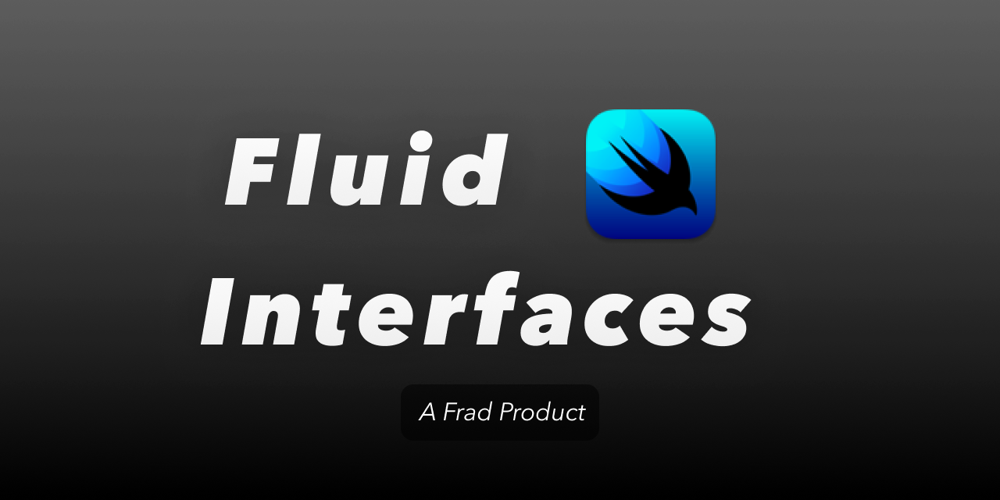

# Fluid Interfaces SwiftUI 

SwiftUI sample code for Apple's WWDC18 talk "[Designing Fluid Interfaces](https://developer.apple.com/wwdc18/803)".

## What is Fluid Interfaces?

Fluid Interfaces is a new concept in iOS development. It is a way to design interfaces that are fluid and responsive. By reading [@nathangitter](https://github.com/nathangitter)'s awsome [articles](https://medium.com/@nathangitter/building-fluid-interfaces-ios-swift-9732bb934bf5) I got a better understanding of Fluid Interfaces, but what he build is written in UIKit. I decided to build Fluid Interfaces in SwiftUI. Most of code in this repository is inspired by [nathangitter/fluid-interfaces](https://github.com/nathangitter/fluid-interfaces).

## Installation

Download or clone the repository and open the `FluidInterfacesSwiftUI.xcodeproj` file with Xcode.

## Interfaces

### [`CalculatorButtonView`](/Shared/Views/CalculatorButtonView.swift)

A iOS calculator app like button.

1. Highlights instantly on touch.
2. Can be tapped rapidly even when mid-animation.
3. User can touch down and drag outside of the button to cancel the tap.
4. User can touch down, drag outside, drag back in, and confirm the tap.

#### Notes

In `UIKit` you can use `touchDown`, `touchDragEnter` or some other useful [`UIControl.Event`](https://developer.apple.com/documentation/uikit/uicontrol/event), in `SwiftUI` you needs to customize these gestures.

But very lucky, the default gesture of `Button` in `SwiftUI` looks match the features we want, all we need is a customized `ButtonStyle`.

#### References
- [Composing SwiftUI Gestures](https://developer.apple.com/documentation/swiftui/composing-swiftui-gestures)
- [Mastering buttons in SwiftUI](https://swiftwithmajid.com/2020/02/19/mastering-buttons-in-swiftui/)

- [Designing Fluid Interfaces ](https://developer.apple.com/videos/play/wwdc2018/803/?time=3013)
- [How to set custom highlighted state of SwiftUI Button](https://stackoverflow.com/a/56980172/3413981 )

### [`SpringAnimationsView`](/Shared/Views/SpringAnimationsView.swift)

A simple spring animation demo.

1. Uses SwiftUI `spring()` animation.
2. No concept of animation duration in single `spring()`.
3. Easily interruptible.

#### Notes

A persistent spring animation. When mixed with other `spring()` or `interactiveSpring()` animations on the same property, each animation will be replaced by their successor, preserving velocity from one animation to the next. Optionally blends the response values between springs over a time period.

#### References

- [SOLVED/ Instantly reset state of animation. ](https://www.hackingwithswift.com/forums/swiftui/instantly-reset-state-of-animation/4494 )
- [swiftui - Spring Animation/ What does the blendDuration parameter do?](https://stackoverflow.com/a/59170144 )

### [`FlashlightButtonView`](/Shared/Views/FlashlightButtonView.swift)

A iOS like flashlight button.

1. Requires an intentional gesture with `LongPressGesture`, [see more](https://developer.apple.com/documentation/swiftui/longpressgesture ).
2. Bounciness hints at the required gesture.
3. Haptic feedback confirms activation.

#### Notes
The [origin version](https://github.com/nathangitter/fluid-interfaces/blob/master/FluidInterfaces/FluidInterfaces/FlashlightButton.swift) calls [3D Touch](https://developer.apple.com/design/human-interface-guidelines/ios/user-interaction/3d-touch/) which has been deprecated, in this version it will replaced by `LongPressGesture` and `DragGesture`.

#### References

- [Composing SwiftUI Gestures](https://developer.apple.com/documentation/swiftui/composing-swiftui-gestures)

### [`RubberbandingView`](/Shared/Views/RubberbandingView.swift)

Rubberbanding occurs when a view resists movement. An example is when a scrolling view reaches the end of its content.

1. Interface is always responsive, even when an action is invalid.
2. De-synced touch tracking indicates a boundary.
3. Amount of motion lessens further from the boundary.

### [`AccelerationPausingView`](/Shared/Views/AccelerationPausingView.swift)

To view the app switcher on iPhone X, the user swipes up from the bottom of the screen and pauses midway. This interface re-creates this behavior.

1. Pause is calculated based on the gesture’s acceleration.
2. Faster stopping results in a faster response.
3. No timers.

#### References

- [Calculate velocity of DragGesture](https://stackoverflow.com/questions/57222885/calculate-velocity-of-draggesture )
- [Gesture Deceleration - Gesture Recognizers in IOS 12, Xcode 10, and Swift 4.2](https://www.youtube.com/watch?v=cXr7ZYJXVAE)
- [SwiftUI Drag Gesture Tutorial](https://www.ioscreator.com/tutorials/swiftui-drag-gesture-tutorial)

### [`RewardingMomentumView`](/Shared/Views/RewardingMomentumView.swift)

A drawer with open and closed states that has bounciness based on the velocity of the gesture.

1. Tapping the drawer opens it without bounciness.
2. Flicking the drawer opens it with bounciness.
3. Interactive, interruptible, and reversible.

### [`FaceTimePiPView`](/Shared/Views/FaceTimePiPView.swift)

A re-creation of the picture-in-picture UI of the iOS FaceTime app.

1. Light weight, airy interaction.
2. Continuous animation that respects the gesture’s initial velocity.

## The Final

## Authors

- **Frad Lee** - _Initial work_ - [@FradSer](https://twitter.com/fradser)

See also the list of [contributors](https://github.com/FradSer/FluidInterfacesSwiftUI/contributors) who participated in this project.

## License

This project is licensed under the MIT License - see the [LICENSE](LICENSE) file for details
